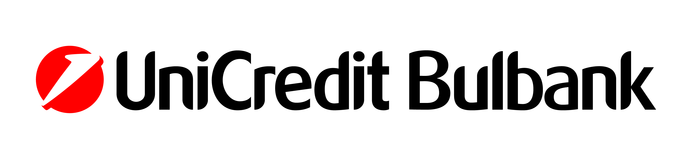

# Summer school on modelling and complex systems 2022

Organized by
<table cellspacing="0" cellpadding="0" border="0">
  <tr>
    <th></th>
    <th></th>
    <th></th>
   </tr>
  <tr>
    <td>FEBA Faculty of Economics and Business Administration <a href="https://feba.uni-sofia.bg/">https://feba.uni-sofia.bg/</a></td>
    <td>FDIBA German Engineering and Industrial Management Faculty <a href="https://fdiba.tu-sofia.bg/">https://fdiba.tu-sofia.bg/</a></td>
    <td>University for National and World Economy <a href="https://unwe.bg">https://unwe.bg</a></td>
  </tr>
 </table>

Partners
<table cellspacing="0" cellpadding="0" border="0">
  <tr>
    <th></th>
    <th></th>
  </tr>
  <tr>
    <td>Unicredit Bulbank <a href="https://www.unicreditbulbank.bg/">https://www.unicreditbulbank.bg/</a></td>
    <td>Lendivo <a href="https://lendivo.com/">https://lendivo.com/</a></td>
  </tr>
 </table>

Associate Partners
<table cellspacing="0" cellpadding="0" border="0">
  <tr>
    <th></th>
  </tr>
  <tr>
    <td>The Edge <a href="https://theedge.solutions/">https://theedge.solutions/</a></td>
  </tr>
 </table>

## Application
**Acknowledgement**: This Summer school is partially funded by ***Science and research Fund at Sofia University (contract 80-10-126-16.05.2022)***. 

**Location**: [Bachkovo Monastery](http://www.bachkovskimanastir.com/bg/), Plovdiv Region, Bulgaria

**Time**: August 26 - September 04, 2022 

**Target audience**: PhD students in their first 18 months and advanced graduates (master students).  

**Official language**: For written materials - Bulgarian or English, for lectures - Bulgarian.

**Application**: **EXTENDED** Deadline for student application is July 20, 2022 by filling-in this application form: [https://forms.gle/r1RAMQjYJqWaWDib9](https://forms.gle/r1RAMQjYJqWaWDib9).    
Only some applications would be approved, who will be notified by e-mail on July 25 and will recieve further instructions.    
Participation in the Summer school is free of charge.

## Main objectives
* Creating an attitude for studying and applying scientific methods in research.
* Winning the hearts and minds of learners to apply the scientific method.
* Permanent change of students' attitudes.
* Upgrading the knowledge and skills for scientific work

**Concept**: Intensive training in methods (not so much applications) through lectures, workshops and team work on projects. 

## Accomodation
**Travel**: The trip is up to the participants to organize on their own (while some coordination effort will be done for optimizing the travel organization. Everyone should arrive by **18:30, on 26 August, Friday**, at the main entrance of the Monastery.   

**Accommodation**: The students are accommodated in pairs / threes / fours in a room in the Monestery. Accomodation costs BGN 40 per bed per night. Out of which **85% is covered by the organizers**. The layout of the rooms will be set by the organizers and can not be changed.   

**Meals**: Meals are up to participants to organize on their own. There are at least 3 major restaurants and a grocery store in the near vicinity.    

**Daily schedule**:  
09:30 - 13:00 Lectures in the classroom  
13:00 - 14:00 Lunch brake  
14:00 - 17:00 Workshops in the classroom   
After 17:00 working on team assignment'   
21:00 Monastery doors close   
'The classroom could be used untill late, but no loud noises permitted.

## Certification
**Cases**: As part of the Summer school the participants would have to solve and present a case, out of several options, which will be given on the first day. <!--[See the cases here...](cases.md)-->

**Certification**: Certificates issued by Faculty of Economics and Business Administration will be issued to those who successfully pass the Summer school in a special cerempny after the end of the Summer school. The requirements are:  
1) at least 70% active participation in the classes  
2) participation in a team with a presented solution at the end  
3) Presented paper at a conference or seminar, showcasing knowledge and skills educated throughout the Summer school.  
Note: Participants who cannot take part fulltime and/or would not comply with the requirements can also join classes, but will not receive a certificate.  

## Technical requirements
Apart from concentrating during the classes, the aproved participants should make sure to be equipped with a **personal computer (not mobile device)** installed with:
* Python 3.9 [https://www.anaconda.com/products/individual](https://www.anaconda.com/download/)
* Anaconda [https://www.anaconda.com/products/individual](https://www.anaconda.com/download/)
* Jupyter Notebook [https://www.anaconda.com/products/individual](https://www.anaconda.com/download/)
<!--* spyder [https://www.anaconda.com/products/individual](https://www.anaconda.com/download/)-->
* R [https://cran.r-project.org/bin/windows/base/](https://cran.r-project.org/bin/windows/base/)
* R Studio [https://www.rstudio.com/products/rstudio/download/#download](https://www.rstudio.com/products/rstudio/download/#download)
* Orange [https://orange.biolab.si/download/](https://orange.biolab.si/download/)
<!--* KNIME [https://www.knime.com/downloads](https://www.knime.com/downloads)-->
* Registration in Github [https://github.com](https://github.com)
<!--* Zoom [https://zoom.com](https://zoom.com) with installed personal photo-->

## Contacts
**Facebook group**: [https://www.facebook.com/groups/223483361788013/](https://www.facebook.com/groups/223483361788013/)

**Organizer**: Faculty of Economics and Business administration, Sofia University. In partnership with Faculty of German Engineering Education and Industrial Management, Technical University - Sofia, University of National and World Econmy, and Lendivo. For questions: angel.marchev@feb.uni-sofia.bg

**Lecturers**:
* Angel Marchev Jr. (angel.marchev@feb.uni-sofia.bg)
* Angel Marchev Sr. (angel_marchev@yahoo.co.uk)
* Alexander Efremov (aefremov@gmail.com)
* Boryana Pelova (bpelova@gmail.com)   
* Demir Tonchev (tonchev.demir@gmail.com)  
* Kaloyan Haralampiev (k_haralampiev@hotmail.com)
* Pavel Nikolov (pavelnnikolov@gmail.com)
* Petar Nikolov (petarnikolov1989@gmail.com)
* Stanimir Kabaivanov (stanimir.kabaivanov@gmail.com)

**Archives**:  
[Summer School on Research Methods 2020](https://marchev-science.github.io/Summer-school-on-research-methods-2020/)  
[Summer School on Modeling and Complex Systems 2021](https://marchev-science.github.io/summer-school-2021/)  

## Cases
The cases for this year's Summer school will be [revieled here...](cases.md) at the start of the Summer school. 

## Programme
(subject to change)  

**2022-08-26 Openning**  
before 18:30 Accomodation   
18:30 - 19:30 Organizational issues  
19:30 - 21:00 Networking exercise

**2022-08-27 Fundamentals**  
09:30 - 13:00 Opening session: Angel Marchev, Sr. - The scientific method & General Systems Theory: a systematic approach to research <!--[video](https://youtube.com/playlist?list=PLX9ryRl9v7BB4Cjh9VivtOTLyMHcOFfu1)-->  
14:00 - 17:00 Workshop: Boyan Markov - Introduction to Python & Jupyter notebook <!--[video](https://youtube.com/playlist?list=PLX9ryRl9v7BB4Cjh9VivtOTLyMHcOFfu1), [materials](/Boyan_Markov/readme.md)-->  
17:00 - 19:30 Workshop: Explaining the cases    
  
**2022-08-28 Fundamentals**  
09:30 - 13:00 Angel Marchev, Sr. - Cybernetics studying complex systems with feedback <!--[video](https://youtube.com/playlist?list=PLX9ryRl9v7BB4Cjh9VivtOTLyMHcOFfu1)-->  
14:00 - 17:00 Workshop: Angel Marchev, Jr. - Introduction to R & R Studio <!--[video](https://youtube.com/playlist?list=PLX9ryRl9v7BB4Cjh9VivtOTLyMHcOFfu1), [materials](/Angel_Marchev_Jr/readme.md)-->  
17:00 - 19:30 Workshop: Teamwork on case assignments  

**2022-08-29 Fundamentals**  
09:30 - 10:30 Demir Tonchev - Introduction to probability <!--[video](https://youtube.com/playlist?list=PLX9ryRl9v7BB4Cjh9VivtOTLyMHcOFfu1), [materials](/Demir_Tonchev/readme.md)-->  
11:00 - 13:00 Kaloyan Haralampiev - Bayesian paradigm <!--[video](https://youtube.com/playlist?list=PLX9ryRl9v7BB4Cjh9VivtOTLyMHcOFfu1), [materials](/Kaloyan_Haralampiev/readme.md)-->   
14:00 - 17:00 Workshop: Demir Tonchev - Introduction to Bayesian modeling <!--[video](https://youtube.com/playlist?list=PLX9ryRl9v7BB4Cjh9VivtOTLyMHcOFfu1), [materials](/Sergey_Vichev/readme.md)-->  
17:00 - 19:30 Workshop: Teamwork on case assignments  

**2022-08-30 Fundamentals**  
09:30 - 13:00 Alexander Efremov, Kaloyan Haralampiev - Data mining: methods & main tasks <!--[video](https://youtube.com/playlist?list=PLX9ryRl9v7BB4Cjh9VivtOTLyMHcOFfu1), [materials](/Alexander_Efremov/readme.md)-->   
14:00 - 17:00 Workshop: Kaloyan Haralampiev - Introduction to Orange <!--[video](https://youtube.com/playlist?list=PLX9ryRl9v7BB4Cjh9VivtOTLyMHcOFfu1), [materials](/Kaloyan_Haralampiev/readme.md)-->  
17:00 - 19:30 Workshop: Teamwork on case assignments  

**2022-08-31 Machine Learning concepts**  
09:30 - 11:00 Alexander Efremov - Introduction to Numerical Optimization <!--[video](https://youtube.com/playlist?list=PLX9ryRl9v7BB4Cjh9VivtOTLyMHcOFfu1), [materials](/Alexander_Efremov/readme.md)-->   
11:30 - 13:00 Workshop: Alexander Efremov - Determination of model structure <!--[video](https://youtube.com/playlist?list=PLX9ryRl9v7BB4Cjh9VivtOTLyMHcOFfu1), [materials](/Alexander_Efremov/readme.md)-->   
14:00 - 17:00 Workshop: TBD - TBD <!--[video](https://youtube.com/playlist?list=PLX9ryRl9v7BB4Cjh9VivtOTLyMHcOFfu1), [materials](/Angel_Marchev_Jr/readme.md)-->   
17:30 - 19:30 Workshop: Teamwork on case assignments  

**2022-09-01 Time series**  
09:30 - 11:00 Boryana Pelova - Time series basics <!--[video](https://youtube.com/playlist?list=PLX9ryRl9v7BB4Cjh9VivtOTLyMHcOFfu1), [materials](/Atanas_Atanassov/readme.md)-->   
11:30 - 13:00 Boryana Pelova - Wavelet analysis <!--[video](https://youtube.com/playlist?list=PLX9ryRl9v7BB4Cjh9VivtOTLyMHcOFfu1)-->  
14:00 - 17:00 Peter Nikolov - Analytics workflow <!--[video](https://youtube.com/playlist?list=PLX9ryRl9v7BB4Cjh9VivtOTLyMHcOFfu1)-->  
17:30 - 19:30 Workshop: Teamwork on case assignments  

**2022-09-02 Artificial Neural Networks**  
09:30 - 13:00 Stanimir Kabaivanov - Introduction to Artificial Neural Networks <!--[video](https://youtube.com/playlist?list=PLX9ryRl9v7BB4Cjh9VivtOTLyMHcOFfu1), [materials](/Angel_Marchev_Jr/readme.md)-->    
14:00 - 15:30 Mihail Motzev - Statistical Learning Networks <!--[video](https://youtube.com/playlist?list=PLX9ryRl9v7BB4Cjh9VivtOTLyMHcOFfu1), [materials](/Mihail_Motzev/readme.md)-->  
16:00 - 17:30 Workshop: TBD - Artificial Neural Networks   
17:30 - 19:30 Workshop: Teamwork on case assignments  

**2022-09-03 Self-organmization & adaptation**  
09:30 - 13:00 Angel Marchev, Sr., Angel Marchev, Jr. - Multi-stage selection procedure and Self-organization <!--[video](https://youtube.com/playlist?list=PLX9ryRl9v7BB4Cjh9VivtOTLyMHcOFfu1), [materials](/Angel_Marchev_Jr/readme.md)-->  
14:00 - 17:00 Pavel Nikolov - Evolutionary alghorithm for hyperparameter optimization <!--[video](https://youtube.com/playlist?list=PLX9ryRl9v7BB4Cjh9VivtOTLyMHcOFfu1), [materials](/Pavel_Nikolov/readme.md)-->     
17:00 - 19:30 Workshop: Teamwork on case assignments    

**2022-09-04 Perspectives**  
09:00 - 09:30 - Checking out of the rooms   
09:30 - 10:30 Pavel Tsankov - Exploring complex networks in finance using statistical methods    
10:30 - 11:30 Petko Ruskov - Monetizing your research <!--[video](https://youtube.com/playlist?list=PLX9ryRl9v7BB4Cjh9VivtOTLyMHcOFfu1), [materials](https://github.com/Marchev-Science/summer-school-2021/tree/main/Martin_Boyanov/readme.md)-->      
12:00 - 12:45 A word from our partners: Unicredit Bulbank     
12:45 - 13:30 A word from our partners: Lendivo     
14:30 - 17:00 Conference - presentation of the solutions to the case assignments <!--[video](https://youtube.com/playlist?list=PLX9ryRl9v7BB4Cjh9VivtOTLyMHcOFfu1)-->  
17:00 - 17:30 Closing ceremony  
